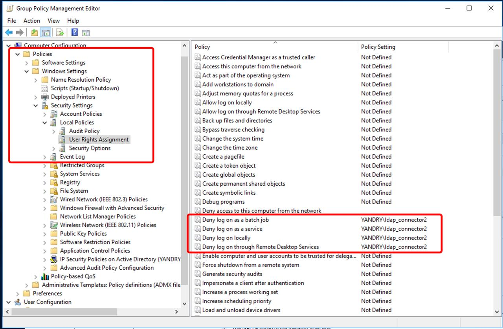

# Синхронизация департаментов пользователей между Active Directory и Yandex 360

## Обзор

Скрипт `sync_deps_for_users.py` предназначен для синхронизации информации о департаментах пользователей между Active Directory (AD) и Yandex 360. Он извлекает данные о пользователях и их департаментах из AD через LDAP, сравнивает их с департаментами в Yandex 360 и обновляет данные в Yandex 360, если необходимо. Скрипт поддерживает режим "сухого прогона" (`DRY_RUN`) для тестирования без внесения изменений. 

Ключевой особенностью работы этого скрипта является использование [иерархической адресной книги Exchange] (https://learn.microsoft.com/en-us/exchange/address-books/hierarchical-address-books/hierarchical-address-books) или её аналога (вложенных групп). В этом случае, имеется корневая группа, в которую вложены другие группы и т.д. Корневая группа представляет собой верхний уровень иерархии подразделений в организации Exchange, вложенные группы - иерархическую структуру подразделений внутри организации. Каждый пользватель в Active Directory может входить только в одну группу внутри данной иерархии.

Скрипт читает информацию о иерархии групп, начиная с корневой группы и воссоздаёт эту иерархию в виде иерархии подразделений в Яндекс 360. Плюс добавляет пользователей Яндекс 360 в соответствующие разделы иерархии.
Скрипт использует уникальный атрибут для группы (например, samAccountName, objectSID или objectGIUD) для идентификации группы в списке подразделений в Яндекс 360. Значение данного уникального атрибута записывается в атрибут externalID подразделения в Яндекс 360 и связывает группу в AD с подразделением в Яндекс 360. Смена имени группы или email адреса отражается в связанном подразделении.
Если у группы в AD есть адрес электронной почты, то он присваивается соответствующему подразделению в Яндекс 360 и это подразделение можно использовать как группу при назначении прав, формированию списка пользователей канала/чата в Мессенджере или как список рассылки в Почте.

## Логика работы

1. **Чтение данных из Active Directory**:
   - Подключается к AD через LDAP (или LDAPS), используя параметры из файла `.env_ldap` (хост, порт, учётная запись, базовый DN, фильтр поиска).
   - Запрашивает атрибуты пользователей и групп, указанные в параметре `ATTRIB_LIST`, соответствующих фильтру (например, членов группы `Yandex360`) и членству в корневой группе иерархической адресной книги.
   - Для каждой группы извлекает:
     - Название группы (атрибут указан в `DEP_NAME_ATTRIBUTE`)
     - Email адрес группы (атрибут указан в `DEP_MAIL_ATTRIBUTE`)
     - Уникальный идентификатор группы (атрибут указан в `DEP_EXTERNAL_ID_ATTRIBUTE`)
   - Формирует список с данными об узлах иерархии и членстве пользователей в этих узлах, например:
        ```
        Global Address Book~hab@domain.ru~#all#;hab_group
        Global Address Book;Division1~div1@domain.ru~hab_group;div1_group
        Global Address Book;Division1|Иван Иванов;ivan@domain.ru
        Global Address Book;Division1;Team1~team1@domain.ru~div1_group;team1_group
        Global Address Book;Division1;Team1|Пётр Петров;petr@domain.ru
        ```
        где:
        - Строки с `~` содержат информацию о группах/подразделениях:
          - `Global Address Book~hab@domain.ru~#all#;hab_group` - корневая группа
          - Формат: `путь~email~externalId_родителя;externalId_группы`
          - Разделитель `;` используется для построения пути к узлу
          - Символ `~` разделяет путь, email и идентификаторы
        - Строки с `|` содержат информацию о членстве пользователей:
          - `Global Address Book;Division1|Иван Иванов;ivan@domain.ru`
          - Формат: `путь_к_группе|имя_пользователя;email_пользователя`
   - Сохраняет результаты в файл, указанный в `AD_DATA_OUT_FILE`, если параметр задан.
   - Проводит валидацию данных:
     - Проверяет, что группа не является членом нескольких групп одновременно
     - Проверяет наличие уникального `externalId` для каждой группы
     - Проверяет отсутствие дублирующихся email адресов

2. **Получение данных из Yandex 360**:
   - Использует API Yandex 360 для получения списка всех подразделений с их атрибутами (`id`, `name`, `parentId`, `label`, `externalId`) и всех пользователей.
   - Формирует структуру подразделений с полными путями от корневого департамента.
   - Сохраняет текущее состояние подразделений и пользователей в файл (префикс `start_state`) для последующего анализа изменений.

3. **Сравнение и синхронизация подразделений**:
   - Сравнивает подразделения из AD с подразделениями в Yandex 360 по значению `externalId`:
     - Если подразделение с таким `externalId` отсутствует в Y360 - создает новое подразделение
     - Если подразделение существует, но отличается родитель - изменяет родительское подразделение
     - Если подразделение существует, но отличается название или email - обновляет соответствующие поля
   - Удаляет из Yandex 360 подразделения, которых нет в AD (по `externalId`):
     - Подразделения без `externalId` (созданные вручную) удаляются только если `KEEP_EMPTY_EXTERNAL_ID_IN_Y360=false`
     - Перед удалением подразделения, все его пользователи переносятся в корневой департамент ("Все")
   - Все операции выполняются поуровнево (сначала уровень 1, потом уровень 2 и т.д.) для сохранения иерархии.

4. **Синхронизация пользователей**:
   - Для каждого пользователя из AD определяет соответствующее подразделение по `externalId` группы.
   - Для каждого пользователя в Yandex 360:
     - Ищет соответствие по `nickname` или `aliases` пользователя с email из AD (без домена)
     - Если пользователь найден и его подразделение не совпадает с данными из AD - обновляет `departmentId`
     - Если пользователь не найден в AD - переносит в корневой департамент ("Все")
   - Все изменения применяются только если `DRY_RUN=false`.

5. **Финализация и логирование**:
   - Сохраняет финальное состояние подразделений и пользователей в файл (префикс `end_state`).
   - Логирует все операции в консоль (уровень INFO) и в файл `sync_deps.log` (уровень DEBUG).
   - Ротация логов происходит при достижении 10 МБ, хранится до 20 резервных копий.
   - В режиме `DRY_RUN=true` только логирует планируемые изменения без их применения.

## Параметры

Скрипт использует переменные окружения, задаваемые в файле `.env_ldap` в каталоге скрипта или непосредственно в окружении:

| Имя параметра         | Описание                                                                 | Обязательный | Пример значения                                    |
|-----------------------|--------------------------------------------------------------------------|--------------|---------------------------------------------------|
| `OAUTH_TOKEN`        | OAuth-токен для аутентификации в API Yandex 360.                         | Да           | `y0_AgAAAA...`                                   |
| `ORG_ID`               | Идентификатор организации в Yandex 360 (целочисленный).                  | Да           | `123456`                                          |
| `LDAP_HOST`           | Адрес контроллера домена (DNS-имя или IP).                               | Да           | `dc01.contoso.com`                                |
| `LDAPS_ENABLED`       | Использовать ли LDAPS протокол (порт должен быть 636).                   | Нет (по умолчанию `false`) | `true` или `false` |
| `LDAP_PORT`           | TCP-порт LDAP (389 для LDAP, 3268 для глобального каталога, 636 для LDAPS). | Да           | `3268`                                            |
| `LDAP_USER`           | Учётная запись для подключения к LDAP (формат: `domain\user`).           | Да           | `contoso\ldap_connector`                          |
| `LDAP_PASSWORD`       | Пароль учётной записи LDAP.                                              | Да           | `password`                                        |
| `LDAP_BASE_DN`        | Базовый DN для поиска пользователей в AD.                                | Да           | `OU=Office,DC=contoso,DC=com`                     |
| `LDAP_SEARCH_FILTER`  | Фильтр поиска пользователей в AD.                                        | Да           | `(memberOf=CN=Yandex360,OU=Groups,OU=Office,DC=contoso,DC=com)` |
| `ATTRIB_LIST`         | Список атрибутов для извлечения из AD (через запятую).                   | Да           | `distinguishedName,mail,displayName,department,objectCategory,sAMAccountName,extensionAttribute14,cn` |
| `DEP_MAIL_ATTRIBUTE`  | Атрибут для запроса значения email группы/подразделения (должен быть в `ATTRIB_LIST`).  | Да           | `mail`                                            |
| `DEP_NAME_ATTRIBUTE`  | Атрибут для запроса значения названия группы/подразделения (должен быть в `ATTRIB_LIST`). | Да           | `displayName`                                     |
| `DEP_EXTERNAL_ID_ATTRIBUTE` | Атрибут для запроса уникального externalId группы/подразделения (должен быть в `ATTRIB_LIST`). | Да | `sAMAccountName` |
| `AD_DEPS_OUT_FILE`    | Имя файла для сохранения иерархии подразделений из AD.                             | Нет          | `ad_deps.txt`                                     |
| `AD_DATA_OUT_FILE`    | Имя файла для сохранения данных пользователей из AD.                      | Нет          | `ad_data.txt`                                     |
| `API_DATA_OUT_FILE`   | Имя файла для сохранения состояния подразделений и пользователей из  API до и после запуска скрипта.                     | Нет          | `api_data.txt`                                    |
| `DRY_RUN`             | Режим "сухого прогона" (`true` для имитации, `false` для изменений).     | Нет (по умолчанию `false`) | `true` или `false` |
| `HAB_ROOT_GROUP` | distinguishedName корневой группы иерархической адресной книги. | Да | `CN=Global Address Book,OU=HAB,DC=domain,DC=ru` |
| `LOAD_AD_DATA_FROM_FILE` | Загружать ли данные из файла вместо AD (для тестирования).            | Нет (по умолчанию `false`) | `true` или `false` |
| `KEEP_EMPTY_EXTERNAL_ID_IN_Y360` | Сохранять ли подразделения, созданные вручную в Y360 (с пустым externalId). | Нет (по умолчанию `false`) | `true` или `false` |

### Примечания к параметрам
- **Обязательные параметры**: `OAUTH_TOKEN`, `ORG_ID`, `LDAP_HOST`, `LDAP_PORT`, `LDAP_USER`, `LDAP_PASSWORD`, `LDAP_BASE_DN`, `LDAP_SEARCH_FILTER`, `ATTRIB_LIST`, `HAB_ROOT_GROUP`, `DEP_MAIL_ATTRIBUTE`, `DEP_NAME_ATTRIBUTE`, `DEP_EXTERNAL_ID_ATTRIBUTE` должны быть заданы. При их отсутствии скрипт завершится с ошибкой.
- **LDAP_HOST**: Для нескольких доменов в AD требуется DNS-имя и настройка DNS-разрешения. Для одного домена можно указать IP.
- **LDAPS_ENABLED**: При использовании защищенного LDAPS протокола установите `true` и порт `636`.
- **ATTRIB_LIST**: Должен включать как минимум `mail`, `distinguishedName`, `displayName`, `objectCategory`, `sAMAccountName`, `extensionAttribute14`, `cn` для корректной работы. Также должен включать атрибуты, указанные в `DEP_MAIL_ATTRIBUTE`, `DEP_NAME_ATTRIBUTE` и `DEP_EXTERNAL_ID_ATTRIBUTE`.
- **DEP_EXTERNAL_ID_ATTRIBUTE**: Должен быть уникальным для каждого департамента. Рекомендуется использовать `sAMAccountName`, `objectSid` или `objectGUID`.
- **DRY_RUN**: Если `true`, скрипт только логирует предполагаемые изменения без их применения.
- **KEEP_EMPTY_EXTERNAL_ID_IN_Y360**: Если `true`, департаменты, созданные вручную в Yandex 360 (без externalId), будут сохранены при синхронизации. Если `false` - будут удалены.
- **Файл `.env_ldap`**: Пример:
  ```
  OAUTH_TOKEN=y0_AgAAAA...
  ORG_ID=123456
  LDAP_HOST=dc01.contoso.com
  LDAPS_ENABLED=False
  LDAP_PORT=3268
  LDAP_USER=contoso\ldap_connector
  LDAP_PASSWORD=password
  LDAP_BASE_DN=OU=Office,DC=contoso,DC=com
  LDAP_SEARCH_FILTER=(memberOf=CN=Yandex360,OU=Groups,OU=Office,DC=contoso,DC=com)
  ATTRIB_LIST=distinguishedName,mail,displayName,department,objectCategory,sAMAccountName,extensionAttribute14,cn
  DEP_MAIL_ATTRIBUTE=mail
  DEP_NAME_ATTRIBUTE=displayName
  DEP_EXTERNAL_ID_ATTRIBUTE=sAMAccountName
  AD_DEPS_OUT_FILE=ad_deps.txt
  AD_DATA_OUT_FILE=ad_data.txt
  API_DATA_OUT_FILE=api_data.txt
  DRY_RUN=False
  HAB_ROOT_GROUP=CN=Global Address Book,OU=HAB,DC=domain,DC=ru
  LOAD_AD_DATA_FROM_FILE=False
  KEEP_EMPTY_EXTERNAL_ID_IN_Y360=False
  ```

## Подготовка.
### Получение OAuth токена.

Создать OAuth токен для аутентификации в API Яндекс 360. Токен должен содержать необходимые права для выполения операций управления ресурсами в организации Яндекс 360. Документация - [Создание приложения](https://yandex.ru/dev/id/doc/ru/register-client). Последовательность шагов для создания токена:
* заходим на https://oauth.yandex.ru/client/new/. Аутентифицируемся от имени администратора организации Яндекс 360.
* Заполняем поля в форме создания приложения:
        - Поле "Название вашего сервиса" - произвольное название.
        - Включаем галочку "Веб сервисы"
        - В поле `Redirect URL` вводим `https://oauth.yandex.ru/verification_code`
        - В разделе "Почта для связи" указываем свой email.


        
* Добавляем разрешения для токена. Для этого в разделе "Доступ к данным" ищем и добавляем следующие разрешения:

| Имя разрешения | Что можно делать |
|----------------|----------|
| directory:read_departments | читать информацию о  подразделениях |
| directory:write_departments | изменять информацию о подразделениях |
| directory:read_users |  читать информацию о пользователях |
| directory:write_users | изменять информацию о пользователях |
        

        
* нажимаем на кнопку "Создать приложение".
* Свойства созданного приложения отображаются в новом окне "Мои приложения". Ищем раздел с идентификатором созданного приложения и копируем строку из поля "ClientID":
      

        
* В текстовом редакторе созадем строку вида `https://oauth.yandex.ru/authorize?response_type=token&client_id=<идентификатор приложения>` и вставляем в ней вместо `<идентификатор приложения>` скопированное значение ClientID из предыдущего пункта. 
Вставляем получившуюся ссылку в браузер и нажимаем "Enter".
* В окне браузера появляется запрос на подтверждение прав токена. Подтверждение **необходимо выполнить от учётной записи администратора организации** (если это сделать от имени обычного пользователя, то токен не получит затребованных прав из-за отсутствия необходимых разрешений у данной пользовательской учётной записи).
Нажимаем "Войти как" и получаем необходимый токен доступа. 


> [!NOTE]
> Полученный токен необходимо указать в файле .env_ldap в качестве значения параметра `OAUTH_TOKEN`

### Получение ID организации Яндекс 360

Для этого необходимо зайти в [консоль администрирования](admin.yandex.ru) и в левом нижнем углу интерфейса будет необходимый номер.
   


> [!NOTE]
> ID организации необходимо указать в файле .env_ldap в качестве значения параметра `ORG_ID`
        
## Установка

1. **Установите Python**: Требуется Python 3.7 или выше.
2. **Установите зависимости**:
   Скрипт требует библиотеки:
   - `python-dotenv`: Для загрузки переменных окружения.
   - `ldap3`: Для работы с LDAP.
   - `requests`: Для запросов к API Yandex 360 (предполагается, что используется в `API360`).

   Установите их с помощью:
   ```bash
   pip install python-dotenv ldap3 requests aiohttp
   ```

3. **Настройте окружение**:
   - Создайте файл `.env_ldap` в каталоге скрипта с параметрами (см. пример выше).
   - Убедитесь, что у вас есть действующий OAuth-токен для Yandex 360, ID организации и учётная запись LDAP с правами чтения AD.

## Запуск

1. **Подготовка**:
   - Поместите скрипт `sync_deps_for_users.py` в рабочий каталог.
   - Создайте и заполните файл `.env_ldap` или задайте переменные окружения.
   - Убедитесь, что файл `lib/y360_api/api_script.py` с классом `API360` доступен.

2. **Запуск скрипта**:
   ```bash
   python sync_deps_for_users.py
   ```
   Скрипт:
   - Подключится к AD и Yandex 360.
   - Сравнит департаменты и обновит данные в Yandex 360 (если `DRY_RUN=false`).
   - Запишет результаты в лог `sync_deps.log` и, если указан `OUT_FILE`, в CSV-файл.

3. **Режим сухого прогона**:
   - Установите `DRY_RUN=true` в `.env_ldap` для тестирования без изменений:
     ```bash
     export DRY_RUN=true
     python sync_deps_for_users.py
     ```

## Логирование

- **Консоль**: Сообщения уровня INFO (например, `2023-10-01 12:00:00.123 INFO: Получен список пользователей AD: 50`).
- **Файл**: Сообщения уровня DEBUG записываются в `sync_deps.log`, ротация при 10 МБ (20 копий).
- Формат: `%(asctime)s.%(msecs)03d %(levelname)s:\t%(message)s` с датой `ГГГГ-ММ-ДД ЧЧ:ММ:СС`.

## Обработка ошибок

- **LDAP-ошибки**: Ошибки подключения или поиска логируются, скрипт завершается.
- **API-ошибки**: Предполагается, что `API360` обрабатывает ошибки; общие исключения логируются.
- **Пустые списки**: Если списки пользователей или департаментов пусты, скрипт завершается с соответствующим сообщением.
- **Отсутствующие пользователи**: Пользователи Yandex 360, отсутствующие в AD, проверяются по псевдонимам.

## Безопасность передачи пароля пользователя для подключения к LDAP каталогу.
Для работы скрипта ему необходимо передать данные об имени входа пользователя в Active Directory и пароле пользователя. Эти данные используются при подключении к LDAP протоколу и получению необходимых данных.
С точки зрения безопасности использовать в открытом виде логин и пароль пользователя не является хорошоей идеей. Однако специфика работы Pythob скрипта такова, что избежать такой операции не представляется возможным:
- пароль не может быть представлен в виде хэша;
- скрытие пароля в виде строки обратного шифрования не повышает защиту от раскрытия пароля, т.к. одна строка в коде скрипта позволит вывести расшифрованный пароль а консоль работы скрипта.
Для повышения безопасности решения можно рекомендовать два механизма:
- передать пароль перед запуском скрипта в виде значения переменной окружения (Environment Variables), при этом удалив соответствующий конфигурационный параметр из конфигурационного файла `.ldap_env`. 
В Windows значение переменной можно задать командой:
```
set LDAP_PASSWORD=password
```
В Linux это будет команда:
```
export LDAP_PASSWORD=password
```
Дополнительно к передачи пароля в виде переменой среды рекомендуется выделить для работы скрипта специальную учётную запись, для которой установить ограничения на подключение к ресурсам в AD. Для этого в групповой политике домена указать такие ограничения:



Это позволит существенно сократить возможности по эксплуататции данных учётной записи.

## Ограничения

- Требуется модуль `API360` из `lib/y360_api/api_script.py` (не предоставлен в коде).
- Поддерживаются только пользователи с заполненным `mail` в AD.
- Поиск по псевдонимам ограничен доменом основного email.
